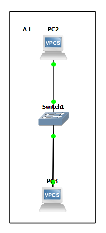
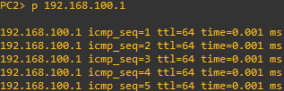
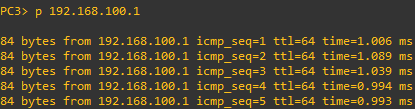

# Dokumentation Übung 1 
- Datum: 29.11.2021
- Name: René Luan Ottenburg
- [Link zur Aufgabenstellung](https://gitlab.com/ch-tbz-it/Stud/m129/-/tree/main/07_GNS3%20Labor%20Anforderungen#2-labor-1-ping-mit-switch)



## PC2 Konfiguration
```
ip 192.168.100.1
```
## PC3 Konfiguration
```
ip 192.168.100.2
```
## Test
```
Von P2:
p 192.168.100.2
```

```
Von P3:
p 192.168.100.1
```

## Neue Lerninhalte
- 

## Reflexion
Viel konnte ich aus der Übung nicht lernen, da ich GNS3 schonmal gebraucht habe und die Commands für die Zuweisung der IP's schon kenne.
