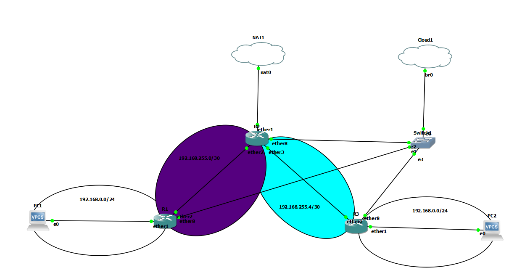

# Dokumentation Übung 7 
- Datum: 24.1.2022
- Name: René Luan Ottenburg
- [Link zur Aufgabenstellung](https://gitlab.com/ch-tbz-it/Stud/m129/-/tree/main/07_GNS3%20Labor%20Anforderungen#8-labor-7-erweiterung-labor-6-mit-firewall)



## MikroTik Konfiguration
### Commands R1

```
/ip pool
add name=dhcp_pool0 ranges=192.168.0.10-192.168.0.254

/ip dhcp-server
add address-pool=dhcp_pool0 interface=ether1 name=dhcp1

/ip address
add address=192.168.0.1/24 interface=ether1 network=192.168.0.0
add address=192.168.23.20/24 interface=ether8 network=192.168.23.0
add address=192.168.255.2/30 interface=ether2 network=192.168.255.0

/ip dhcp-server network
add address=192.168.0.0/24 dns-server=8.8.8.8 gateway=192.168.0.1

/ip firewall nat
add action=masquerade chain=srcnat out-interface=ether2

/ip route
add dst-address=0.0.0.0/0 gateway=192.168.255.1
```
### Commands R2
```
/ip address
add address=192.168.23.21/24 interface=ether8 network=192.168.23.0
add address=192.168.255.1/30 interface=ether2 network=192.168.255.0
add address=192.168.255.5/30 interface=ether3 network=192.168.255.4

/ip dhcp-client
add interface=ether1

/ip firewall nat
add action=masquerade chain=srcnat out-interface=ether1
```
### Commands R3
```
/ip pool
add name=dhcp_pool0 ranges=192.168.0.10-192.168.0.254

/ip dhcp-server
add address-pool=dhcp_pool0 interface=ether1 name=dhcp1

/ip address
add address=192.168.0.1/24 interface=ether1 network=192.168.0.0
add address=192.168.23.22/24 interface=ether8 network=192.168.23.0
add address=192.168.255.6/30 interface=ether2 network=192.168.255.4

/ip dhcp-server network
add address=192.168.0.0/24 dns-server=8.8.8.8 gateway=192.168.0.1

/ip firewall nat
add action=masquerade chain=srcnat out-interface=ether2

/ip route
add dst-address=0.0.0.0/0 gateway=192.168.255.5
```
## VPC Konfiguration

### Commands PC1
```
dhcp
```
### Commands PC2
```
dhcp
```
## Quellen
- https://help.mikrotik.com/

## Neue Lerninhalte
- NAT aufsetzten in Mikrotik

## Reflexion
Das NAT in Mikrotik ist sehr simpel. Ausserdem konnte ich das GUI für den Debian Client schnell herunterladen dadurch, dass ich den Computer direkt ans NAT angeschlossen habe.
