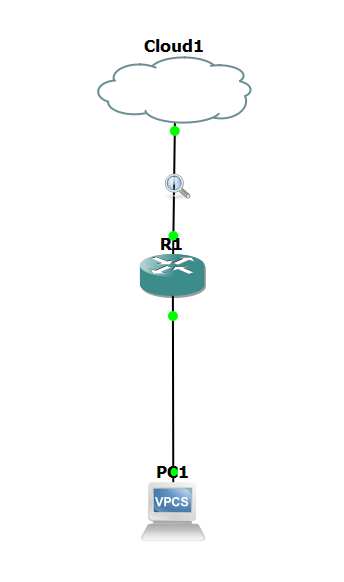

# Dokumentation Übung 2 
- Datum: 26.11.2021
- Name: René Luan Ottenburg
- [Link zur Aufgabenstellung](https://gitlab.com/ch-tbz-it/Stud/m129/-/tree/main/20_GNS3%20Einf%C3%BChrung)

## Windows Konfiguration
Im CMD als Admin
route -p ADD 192.168.24.0 MASK 255.255.255.0 192.168.23.24

## Cisco Konfiguration
### Commands
enable
config t
    int f0/0
        ip add 192.168.23.24 255.255.255.0
        no shut 
    exit
    int f1/0
        ip add 192.168.24.1 255.255.255.0
        no shut 
    exit
exit

## VPC Konfiguration
ip 192.168.24.2 255.255.255.0 192.168.24.1

## Quellen
- https://www.howtogeek.com/howto/windows/adding-a-tcpip-route-to-the-windows-routing-table/

## Neue Lerninhalte
- Lokaler Route auf Windows erstellen

## Reflexion
Die Übung war für mich ziemlich Simpel, jedoch überlegte ich zuerst in die falsche Richtung, denn ich dachte man müsste ein Portforwarding konfigurieren. Weshalb ich in Zukunft die Videos zuerst anschauen werden bevor ich die aufgabe ausführe.
